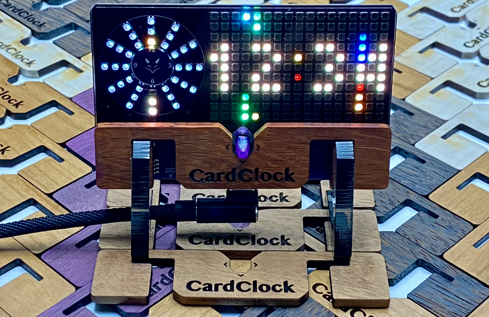
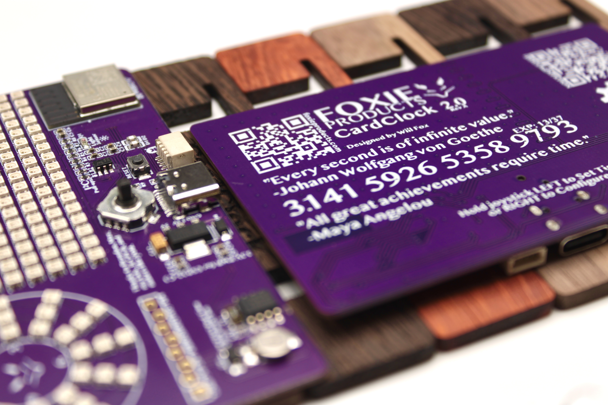

# Foxie CardClock 2.0  

This is a certified Open Source Hardware ([OSHW US002055](https://certification.oshwa.org/us002055.html)) clock that you are going to love. It is much more than the sum of its parts, including innovative features like built-in online firmware updates, a modern 160Mhz RISC-V processor that has WiFi (and BLE, though not yet supported), lots of configurability, time memory, light level awareness, and much, much more. 

There are 3 rings of 12 LEDs at the left side of the PCB, which are used to display Hours, Minutes and Seconds. The Minutes and Seconds display with a 5 minute/second resolution.

Enter the 17x11 LED matrix, including a library that has functions for drawing characters, scrolling, and more. All A-Z, 0-9 and most symbols are supported. The Foxie Clock Operating System is shared with the Foxie Clock 2.0 (see below).

#### Powered by FCOS
This is the firmware underpinning all the cool functionality. See [github.com/foxieproducts/fcos](https://github.com/foxieproducts/fcos) for a thorough rundown of [how to navigate](https://github.com/foxieproducts/fcos) the clock's streamlined interface.

## Unplug your clock to move it?
Uses a modern USB-C connector. The time is remembered for more than 2 days,
with no need to ever replace a battery. What a time to be alive, right?

## Multiple animation styles, online updates, and more?
There are multiple animation styles, WiFi online updates, and even expansion capabilities.

The circuit board is a simple, 2-layer single-sided PCB, using 223 LEDs, a hilariously powerful 160Mhz RISC-V Espressif ESP32-C3-MINI processor with 320KB RAM and 4MB flash. Then an external Real Time Clock, with a 32.768Khz Qwartz crystal, with a dedicated supercapacitor backup is added, just to make sure you don't lose the time. Take it apart, customize it, make it your own.

## Expansion
There are two expansion ports, including a QWIIC expansion port (use any of [SparkFun's](https://www.sparkfun.com/search/results?term=qwiic+sensor) or [Adafruit's](https://www.adafruit.com/?q=qwiic+sensor&sort=BestMatch) sensors, or the 8-pin expansion port including `GND`, `5V`, `3.3v`, `SDA`, `SCL`, and `3` GPI (or `1` + `UART TX/RX`).

## How can you get yours?
Buy one at [tindie.com](https://www.tindie.com/stores/foxieproducts/) or at [foxieproducts.com](https://foxieproducts.com).
