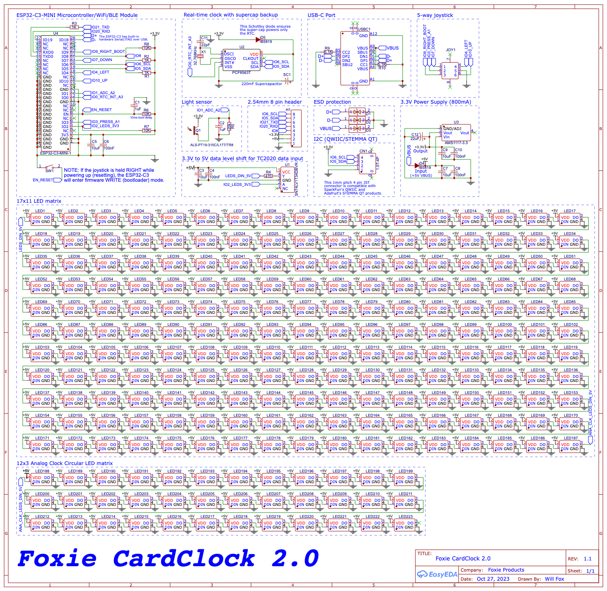
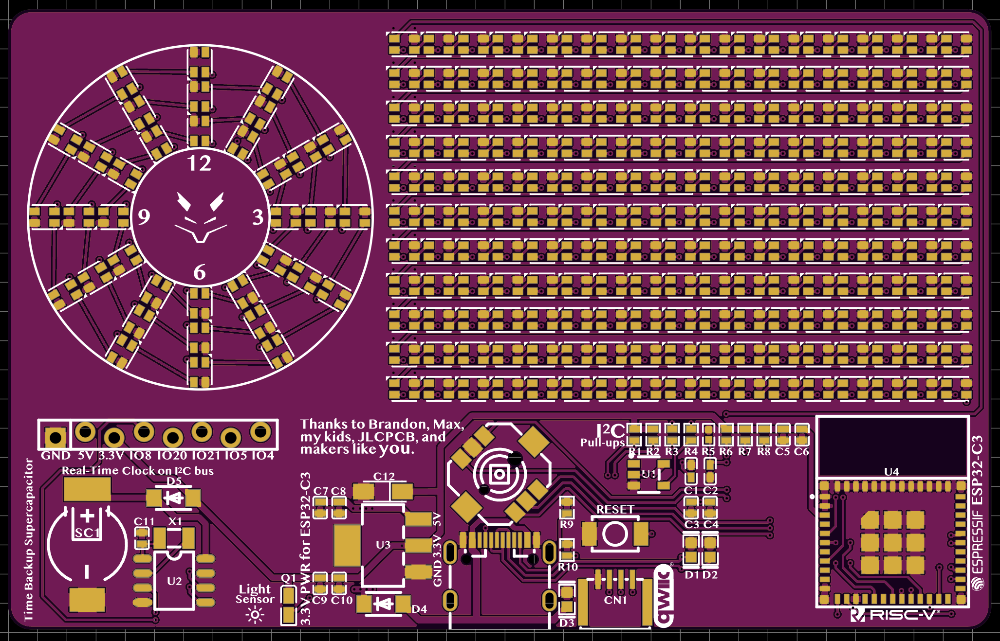

# CardClock 2.0 Printed Circuit Board (PCB)
The PCB was designed with [EasyEDA](https://easyeda.com). The top layer has a copper pour for the GND net, and the bottom has a 5V pour. Both top and bottom have exclusion areas for the WiFi antenna, so that range is affected as little as possible. The schematic is nearly identical to the [Foxie Clock 2.0](https://github.com/foxieproducts/fc2/), apart from the different supercapacitor and extra LEDs that the CardClock 2.0 has.
## Schematic

## PCB Top

## PCB Bottom

